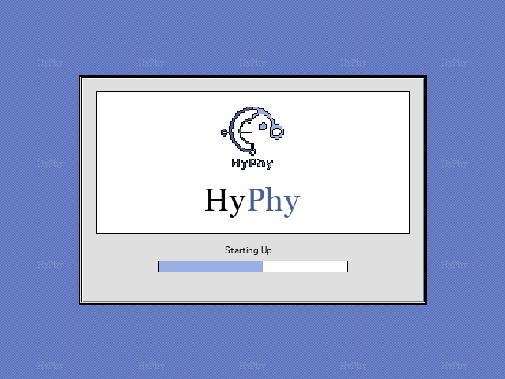

<div style="text-align: center; margin-top: 10px; margin-bottom: 25px;">
  
</div>

# Hypothesis Testing using Phylogenies (HyPhy)

HyPhy is an open-source software package for comparative sequence analysis using stochastic evolutionary models. It provides a suite of advanced phylogenetic methods to detect and test for natural selection, recombination, co-evolution, and rate variation across genes and lineages.

---

!!! info "Run Online on Datamonkey"
    Don't want to install HyPhy locally? You can run all standard HyPhy analyses on our high-performance computing public cluster at [datamonkey.org](https://www.datamonkey.org), or run them directly in your web browser at **[v3.datamonkey.org](https://v3.datamonkey.org)** (runs entirely client-side in your browser!), and visualize the results interactively via [vision.hyphy.org](https://vision.hyphy.org).

<div class="finder-window" style="border: 1px solid #000000; background-color: #FFFFFF; font-family: 'Geneva', 'Chicago', monospace, sans-serif; font-size: 11px; margin-bottom: 25px; box-shadow: 3px 3px 0px #000000; clear: both;">
  <!-- Title bar -->
  <div style="background-color: #ECECEC; height: 18px; border-bottom: 1px solid #000000; text-align: center; line-height: 18px; font-weight: bold; color: #000000; letter-spacing: 0.5px; position: relative;">
    Recent Publications
    <!-- Window widgets -->
    <div style="position: absolute; left: 8px; top: 3px; width: 11px; height: 11px; border: 1px solid #000000; background-color: #FFFFFF; box-shadow: 1px 1px 0px #FFFFFF inset, -1px -1px 0px #808080 inset;"></div>
  </div>
  <!-- Info bar -->
  <div style="background-color: #FFFFFF; height: 16px; border-bottom: 1px solid #000000; font-size: 9px; line-height: 16px; padding: 0 10px; color: #000000; display: flex; justify-content: space-between;">
    <span>10 items</span>
    <span>25.4 MB in folder</span>
    <span>650 MB available</span>
  </div>
  <!-- Headers -->
  <div style="background-color: #ECECEC; height: 18px; border-bottom: 1px solid #000000; display: flex; font-weight: bold; line-height: 18px; color: #000000; padding: 0 10px;">
    <div style="width: 50%;">Name</div>
    <div style="width: 15%; text-align: right; padding-right: 15px;">Size</div>
    <div style="width: 23%;">Kind</div>
    <div style="width: 12%;">Label</div>
  </div>
  <!-- List items -->
  <div style="color: #000000; padding: 5px 10px;">
    <!-- Datamonkey 3 -->
    <div style="display: flex; height: 20px; line-height: 20px; align-items: center;">
      <div style="width: 50%; white-space: nowrap; overflow: hidden; text-overflow: ellipsis;">
        <svg width="10" height="12" viewBox="0 0 12 14" style="vertical-align: middle; margin-right: 6px;"><polygon points="0,0 8,0 12,4 12,14 0,14" fill="#FFFFFF" stroke="#000000" stroke-width="1.2"/><polygon points="8,0 8,4 12,4" fill="#FFFFFF" stroke="#000000" stroke-width="1.2"/></svg>
        <a href="papers/datamonkey3/" style="text-decoration: none !important; color: #000000 !important; font-weight: normal !important;">Datamonkey 3</a>
      </div>
      <div style="width: 15%; text-align: right; padding-right: 15px;">1.1 MB</div>
      <div style="width: 23%;">Web Platform</div>
      <div style="width: 12%;">2026</div>
    </div>
    <!-- PRIME -->
    <div style="display: flex; height: 20px; line-height: 20px; align-items: center;">
      <div style="width: 50%; white-space: nowrap; overflow: hidden; text-overflow: ellipsis;">
        <svg width="10" height="12" viewBox="0 0 12 14" style="vertical-align: middle; margin-right: 6px;"><polygon points="0,0 8,0 12,4 12,14 0,14" fill="#FFFFFF" stroke="#000000" stroke-width="1.2"/><polygon points="8,0 8,4 12,4" fill="#FFFFFF" stroke="#000000" stroke-width="1.2"/></svg>
        <a href="papers/prime/" style="text-decoration: none !important; color: #000000 !important; font-weight: normal !important;">PRIME Selection</a>
      </div>
      <div style="width: 15%; text-align: right; padding-right: 15px;">4.5 MB</div>
      <div style="width: 23%;">HyPhy Method</div>
      <div style="width: 12%;">2026</div>
    </div>
    <!-- BUSTED-PH -->
    <div style="display: flex; height: 20px; line-height: 20px; align-items: center;">
      <div style="width: 50%; white-space: nowrap; overflow: hidden; text-overflow: ellipsis;">
        <svg width="10" height="12" viewBox="0 0 12 14" style="vertical-align: middle; margin-right: 6px;"><polygon points="0,0 8,0 12,4 12,14 0,14" fill="#FFFFFF" stroke="#000000" stroke-width="1.2"/><polygon points="8,0 8,4 12,4" fill="#FFFFFF" stroke="#000000" stroke-width="1.2"/></svg>
        <a href="papers/busted-ph/" style="text-decoration: none !important; color: #000000 !important; font-weight: normal !important;">BUSTED-PH</a>
      </div>
      <div style="width: 15%; text-align: right; padding-right: 15px;">2.0 MB</div>
      <div style="width: 23%;">HyPhy Method</div>
      <div style="width: 12%;">2026</div>
    </div>
    <!-- B-STILL -->
    <div style="display: flex; height: 20px; line-height: 20px; align-items: center;">
      <div style="width: 50%; white-space: nowrap; overflow: hidden; text-overflow: ellipsis;">
        <svg width="10" height="12" viewBox="0 0 12 14" style="vertical-align: middle; margin-right: 6px;"><polygon points="0,0 8,0 12,4 12,14 0,14" fill="#FFFFFF" stroke="#000000" stroke-width="1.2"/><polygon points="8,0 8,4 12,4" fill="#FFFFFF" stroke="#000000" stroke-width="1.2"/></svg>
        <a href="papers/b-still/" style="text-decoration: none !important; color: #000000 !important; font-weight: normal !important;">B-STILL Stasis</a>
      </div>
      <div style="width: 15%; text-align: right; padding-right: 15px;">7.0 MB</div>
      <div style="width: 23%;">HyPhy Method</div>
      <div style="width: 12%;">2026</div>
    </div>
    <!-- BUSTED+MSS -->
    <div style="display: flex; height: 20px; line-height: 20px; align-items: center;">
      <div style="width: 50%; white-space: nowrap; overflow: hidden; text-overflow: ellipsis;">
        <svg width="10" height="12" viewBox="0 0 12 14" style="vertical-align: middle; margin-right: 6px;"><polygon points="0,0 8,0 12,4 12,14 0,14" fill="#FFFFFF" stroke="#000000" stroke-width="1.2"/><polygon points="8,0 8,4 12,4" fill="#FFFFFF" stroke="#000000" stroke-width="1.2"/></svg>
        <a href="papers/busted-mss/" style="text-decoration: none !important; color: #000000 !important; font-weight: normal !important;">BUSTED+MSS</a>
      </div>
      <div style="width: 15%; text-align: right; padding-right: 15px;">855 KB</div>
      <div style="width: 23%;">HyPhy Method</div>
      <div style="width: 12%;">2026</div>
    </div>
    <!-- CAPHEINE -->
    <div style="display: flex; height: 20px; line-height: 20px; align-items: center;">
      <div style="width: 50%; white-space: nowrap; overflow: hidden; text-overflow: ellipsis;">
        <svg width="10" height="12" viewBox="0 0 12 14" style="vertical-align: middle; margin-right: 6px;"><polygon points="0,0 8,0 12,4 12,14 0,14" fill="#FFFFFF" stroke="#000000" stroke-width="1.2"/><polygon points="8,0 8,4 12,4" fill="#FFFFFF" stroke="#000000" stroke-width="1.2"/></svg>
        <a href="papers/capheine/" style="text-decoration: none !important; color: #000000 !important; font-weight: normal !important;">CAPHEINE Workflow</a>
      </div>
      <div style="width: 15%; text-align: right; padding-right: 15px;">963 KB</div>
      <div style="width: 23%;">HyPhy Workflow</div>
      <div style="width: 12%;">2026</div>
    </div>
    <!-- AOC -->
    <div style="display: flex; height: 20px; line-height: 20px; align-items: center;">
      <div style="width: 50%; white-space: nowrap; overflow: hidden; text-overflow: ellipsis;">
        <svg width="10" height="12" viewBox="0 0 12 14" style="vertical-align: middle; margin-right: 6px;"><polygon points="0,0 8,0 12,4 12,14 0,14" fill="#FFFFFF" stroke="#000000" stroke-width="1.2"/><polygon points="8,0 8,4 12,4" fill="#FFFFFF" stroke="#000000" stroke-width="1.2"/></svg>
        <a href="papers/aoc/" style="text-decoration: none !important; color: #000000 !important; font-weight: normal !important;">AOC Snakemake</a>
      </div>
      <div style="width: 15%; text-align: right; padding-right: 15px;">333 KB</div>
      <div style="width: 23%;">HyPhy Workflow</div>
      <div style="width: 12%;">2026</div>
    </div>
    <!-- Non-Reversible -->
    <div style="display: flex; height: 20px; line-height: 20px; align-items: center;">
      <div style="width: 50%; white-space: nowrap; overflow: hidden; text-overflow: ellipsis;">
        <svg width="10" height="12" viewBox="0 0 12 14" style="vertical-align: middle; margin-right: 6px;"><polygon points="0,0 8,0 12,4 12,14 0,14" fill="#FFFFFF" stroke="#000000" stroke-width="1.2"/><polygon points="8,0 8,4 12,4" fill="#FFFFFF" stroke="#000000" stroke-width="1.2"/></svg>
        <a href="papers/non-reversible/" style="text-decoration: none !important; color: #000000 !important; font-weight: normal !important;">Non-Reversible Models</a>
      </div>
      <div style="width: 15%; text-align: right; padding-right: 15px;">1.2 MB</div>
      <div style="width: 23%;">HyPhy Method</div>
      <div style="width: 12%;">2023</div>
    </div>
    <!-- Zoonotic Outbreaks -->
    <div style="display: flex; height: 20px; line-height: 20px; align-items: center;">
      <div style="width: 50%; white-space: nowrap; overflow: hidden; text-overflow: ellipsis;">
        <svg width="10" height="12" viewBox="0 0 12 14" style="vertical-align: middle; margin-right: 6px;"><polygon points="0,0 8,0 12,4 12,14 0,14" fill="#FFFFFF" stroke="#000000" stroke-width="1.2"/><polygon points="8,0 8,4 12,4" fill="#FFFFFF" stroke="#000000" stroke-width="1.2"/></svg>
        <a href="papers/viral-selection/" style="text-decoration: none !important; color: #000000 !important; font-weight: normal !important;">Zoonotic Outbreaks</a>
      </div>
      <div style="width: 15%; text-align: right; padding-right: 15px;">2.4 MB</div>
      <div style="width: 23%;">Application (Cell)</div>
      <div style="width: 12%;">2026</div>
    </div>
    <!-- Human Y -->
    <div style="display: flex; height: 20px; line-height: 20px; align-items: center;">
      <div style="width: 50%; white-space: nowrap; overflow: hidden; text-overflow: ellipsis;">
        <svg width="10" height="12" viewBox="0 0 12 14" style="vertical-align: middle; margin-right: 6px;"><polygon points="0,0 8,0 12,4 12,14 0,14" fill="#FFFFFF" stroke="#000000" stroke-width="1.2"/><polygon points="8,0 8,4 12,4" fill="#FFFFFF" stroke="#000000" stroke-width="1.2"/></svg>
        <a href="papers/human-y/" style="text-decoration: none !important; color: #000000 !important; font-weight: normal !important;">Human Y Chromosome</a>
      </div>
      <div style="width: 15%; text-align: right; padding-right: 15px;">3.7 MB</div>
      <div style="width: 23%;">Application</div>
      <div style="width: 12%;">2026</div>
    </div>
  </div>
</div>

---

##  Key Capabilities & Core Analyses

HyPhy implements state-of-the-art statistical models to answer fundamental evolutionary questions:

### 1. Natural Selection Inference
* **Episodic Selection (MEME)**: Finds individual sites subject to positive selection along a subset of branches. **MEME is the preferred approach for identifying site-specific positive selection.**
* **Pervasive Selection (FUBAR / FEL / SLAC)**: Detects sites under consistent selective pressure across the entire phylogeny. FUBAR is the fastest, high-power Bayesian method.
* **Gene-Wide & Branch-Specific Selection (BUSTED / aBSREL)**: Tests if a gene has experienced selection on any site/branch (BUSTED) or identifies exactly which branches are subject to episodic selection (aBSREL).
* **Selection Relaxation (RELAX)**: Compares test and reference branches to determine if selective constraints have been relaxed or intensified.

### 2. Recombination Detection
* **GARD (Genetic Algorithm for Recombination Detection)**: Identifies recombination breakpoints in alignments and partitions sequence data to avoid phylogenetic artifacts.

---

##  Companion Services & Ecosystem

HyPhy operates within a modern ecosystem designed to simplify analysis and visualize complex datasets:

```
[ Datamonkey Web Server ] ---> [ HyPhy Engine (CLI/HBL) ] ---> [ HyPhy Vision (Interactive JSONs) ]
      (datamonkey.org)               (Local Execution)                  (vision.hyphy.org)
```

### Datamonkey (https://www.datamonkey.org)
[Datamonkey](https://www.datamonkey.org) is the companion web server for HyPhy. It allows researchers to upload sequence data and run computationally intensive HyPhy analyses through a browser interface without local installation. Datamonkey runs on high-performance compute clusters and delivers results directly to your browser.

### HyPhy Vision (https://vision.hyphy.org)
HyPhy analyses generate standard, detailed machine-readable JSON outputs. [HyPhy Vision](https://vision.hyphy.org) is the interactive visualization platform that parses these JSON files to render responsive phylogenies, site selection plots, fitting parameters, and alignment browsers.

---

##  Getting Started with HyPhy

HyPhy fits your research pipeline, whether you prefer GUI, command line, or writing custom code:

* **Interactive CLI**: Simply run `hyphy -i` to launch an interactive command-line helper that guides you step-by-step through choosing an analysis and configuring parameters.
* **Scripted CLI**: Run standard analyses headlessly in pipelines (e.g., `hyphy meme --alignment data.fas --tree tree.nwk`).
* **HBL (HyPhy Batch Language)**: Write custom scripts to define novel evolutionary models, perform complex computations, and build bespoke pipelines.

[Install HyPhy Now](installation/) | [Follow the CLI Tutorial](tutorials/CLI-tutorial/) | [Read the HBL Reference](hbl-reference/)
