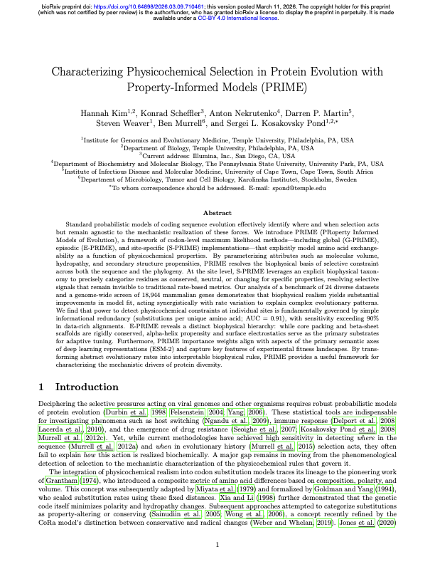
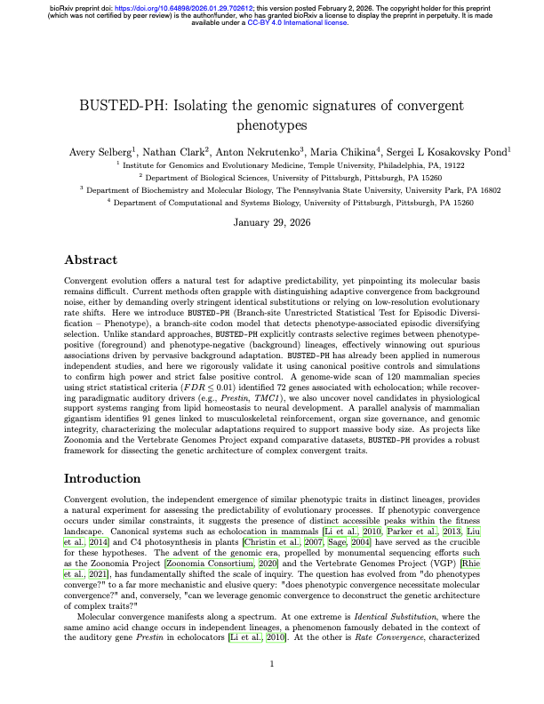
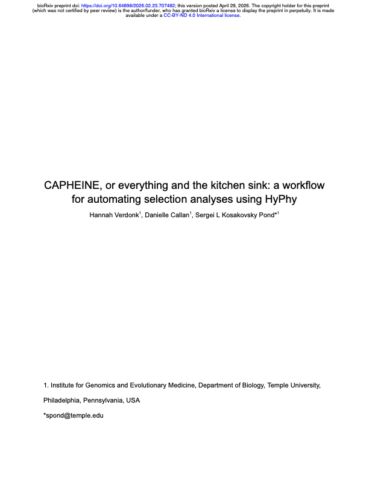
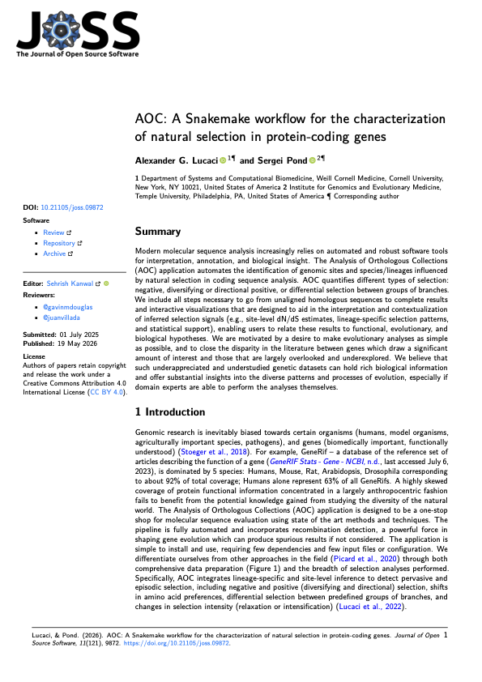
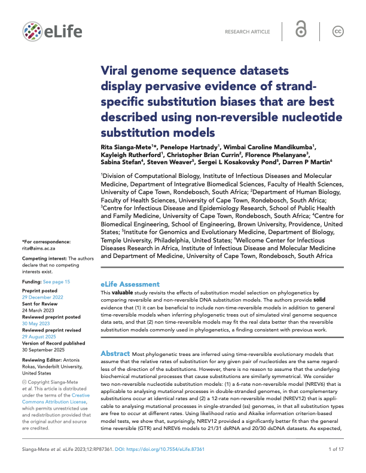
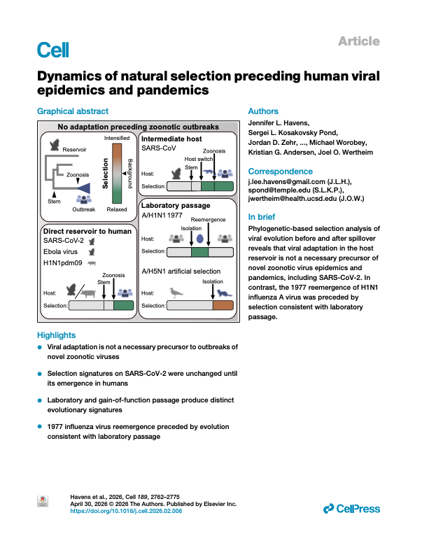
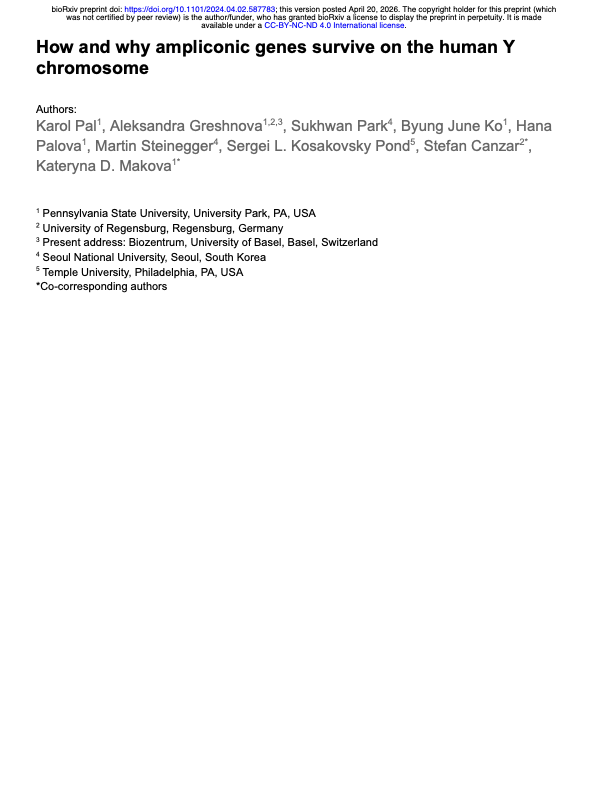

# Publications & Manuscripts

This page lists recent papers on new HyPhy methods and research groups, compiling the latest methodological developments, software workflows, and biological applications. Each publication is presented with its summary, implementation details, key findings, and references.

---

## Evolutionary Methods & Workflows

These papers introduce novel statistical models, hierarchical Bayesian frameworks, and workflow automations integrated into the HyPhy ecosystem.

  

     Method / Web Platform
    v3.datamonkey.org
  

  
<a href="datamonkey3/">Datamonkey 3: Browser-native molecular evolution analysis</a>

  
<strong>Authors:</strong> Steven Weaver, Ben Murrell, Anton Nekrutenko, Sergei L. Kosakovsky Pond

  

    
    
Compiles the HyPhy analysis engine to WebAssembly to run selection and recombination tests serverlessly in the user's browser, preserving data privacy and bypassing server queues.

  

  

     Method / Model
    PRIME Selection
  

  
<a href="prime/">Characterizing Physicochemical Selection in Protein Evolution with Property-Informed Models (PRIME)</a>

  
<strong>Authors:</strong> Hannah Kim, Konrad Scheffler, Anton Nekrutenko, Darren P. Martin, Steven Weaver, Ben Murrell, Sergei L. Kosakovsky Pond

  

    
    
Integrates biophysical properties (volume, charge, hydrophobicity) into codon substitution models (G-PRIME, E-PRIME, and S-PRIME) to resolve the physical basis of evolutionary constraints.

  

  

     Method / Model
    BUSTED-PH Phenotypes
  

  
<a href="busted-ph/">BUSTED-PH: Isolating the genomic signatures of convergent phenotypes</a>

  
<strong>Authors:</strong> Avery Selberg, Nathan Clark, Anton Nekrutenko, Maria Chikina, Sergei L. Kosakovsky Pond

  

    
    
Introduces a branch-site codon test to identify phenotype-associated episodic diversifying selection, contrasting foreground (phenotype-positive) against background lineages.

  

  

     Method / Model
    B-STILL Stasis
  

  
<a href="b-still/">Beyond Invariable Sites: Using Evolutionary Stasis to Map Multi-Layered Constraints on the Evolution of Viral and Mammalian Genomes</a>

  
<strong>Authors:</strong> Sergei L. Kosakovsky Pond, Hannah Verdonk, Steven Weaver, Gallean Brown, Danielle Callan, Anton Nekrutenko, Darren P. Martin

  

    
    
A hierarchical Bayesian framework (B-STILL) that analyzes invariant sites to distinguish stochastic stasis from extreme purifying selection, mapping Evolutionary Stasis Anchors (ESAs).

  

  

     Method / Model
    BUSTED+MSS Synonymous Correction
  

  
<a href="busted-mss/">Correcting for Global Synonymous Selection Improves the Accuracy of Episodic Positive Selection Inference</a>

  
<strong>Authors:</strong> Hannah Verdonk, Alyssa Pivirotto, Jody Hey, Sergei L. Kosakovsky Pond

  

    
    
Corrects BUSTED for global purifying selection acting on synonymous sites (Multiclass Synonymous Substitution, MSS) to prevent false positives in positive selection inference.

  

  

     Method / Workflow
    CAPHEINE Automation
  

  
<a href="capheine/">CAPHEINE, or everything and the kitchen sink: a workflow for automating selection analyses using HyPhy</a>

  
<strong>Authors:</strong> Hannah Verdonk, Danielle Callan, Sergei L. Kosakovsky Pond

  

    
    
An automated, scalable pipeline that streamlines sequence curation, codon alignment, tree building, and the execution of multiple selection analyses in HyPhy.

  

  

     Method / Workflow
    AOC Workflow
  

  
<a href="aoc/">AOC: A Snakemake workflow for the characterization of natural selection in protein-coding genes</a>

  
<strong>Authors:</strong> Alexander G. Lucaci, Sergei L. Kosakovsky Pond

  

    
    
A Snakemake-based workflow automating data preparation and multi-model HyPhy runs, compiling results into interactive HTML dashboards for research sharing.

  

  

     Method / Substitution Models
    Non-Reversible Matrix
  

  
<a href="non-reversible/">Viral genome sequence datasets display pervasive evidence of strand-specific substitution biases...</a>

  
<strong>Authors:</strong> Rita Sianga-Mete, Penelope Hartnady, Wimbai Caroline Mandikumba, Kayleigh Rutherford, Christopher Brian Currin, Florence Phelanyane, Sabina Stefan, Steven Weaver, Sergei L. Kosakovsky Pond, Darren P. Martin

  

    
    
Introduces non-reversible models NREV6 and NREV12 to represent strand-specific mutational asymmetry, demonstrating substantial improvements in viral phylogenetic trees.

  

---

## Biological Applications

These studies utilize HyPhy evolutionary methodologies to resolve specific biological questions in virology and genomics.

  

     Application / Virology
    Epidemics & Pandemics
  

  
<a href="viral-selection/">Dynamics of natural selection preceding human viral epidemics and pandemics</a>

  
<strong>Authors:</strong> Jennifer L. Havens, Sergei L. Kosakovsky Pond, Jordan D. Zehr, Joel O. Wertheim, Kristian G. Andersen, Michael Worobey, Joel O. Wertheim, etc.

  

    
    
Cell study utilizing HyPhy's RELAX, aBSREL, and MEME models to demonstrate that viral adaptation in host reservoirs is not a prerequisite for epidemics, while identifying clear evolutionary signatures of lab passage.

  

  

     Application / Genomics
    Human Y Chromosome
  

  
<a href="human-y/">How and why ampliconic genes survive on the human Y chromosome</a>

  
<strong>Authors:</strong> Karol Pal, Aleksandra Greshnova, Sukhwan Park, Byung June Ko, Hana Palova, Martin Steinegger, Sergei L. Kosakovsky Pond, Stefan Canzar, Kateryna D. Makova

  

    
    
Uses HyPhy purifying selection tests to explore the survival of multicopy ampliconic fertility genes on the non-recombining human Y chromosome, highlighting gene conversion repair mechanisms.

  

