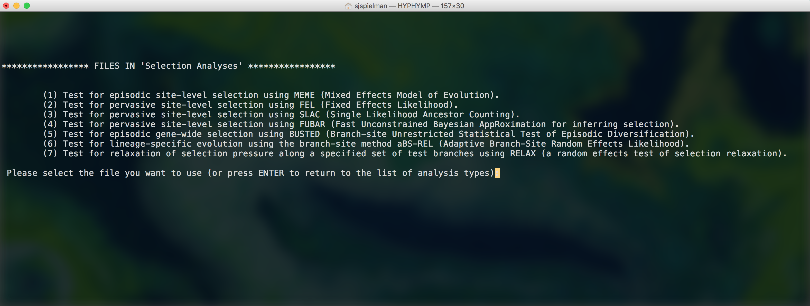
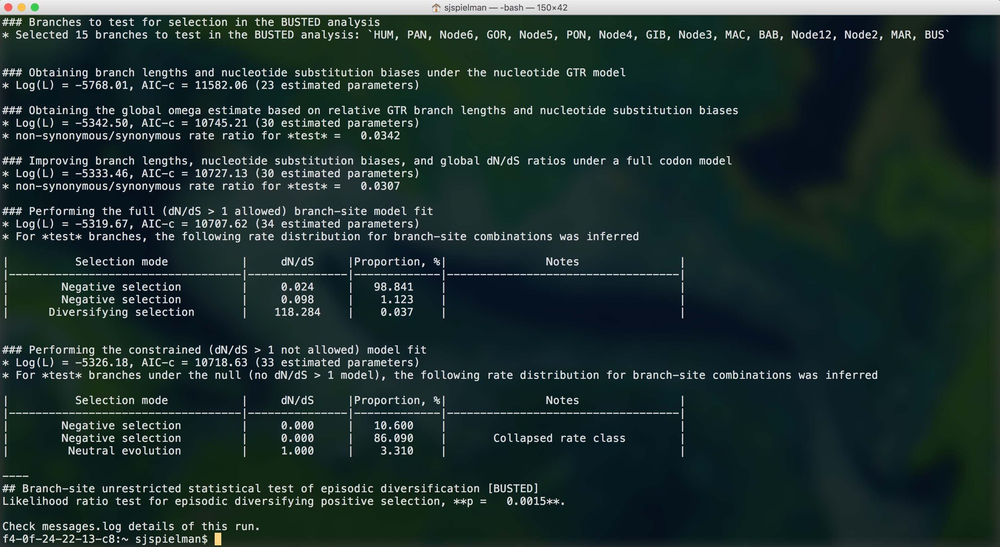
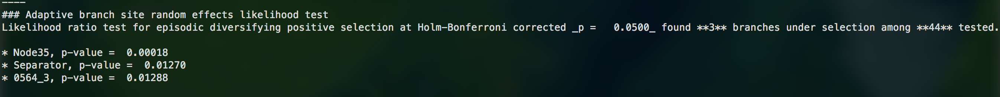
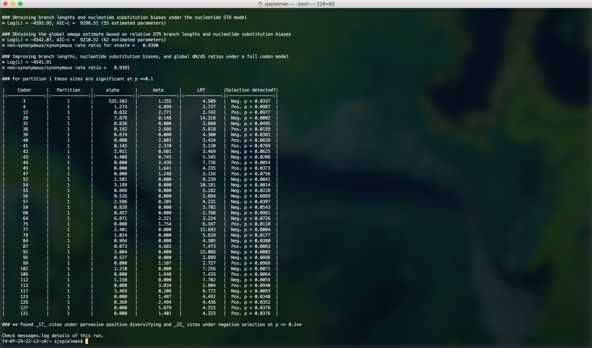
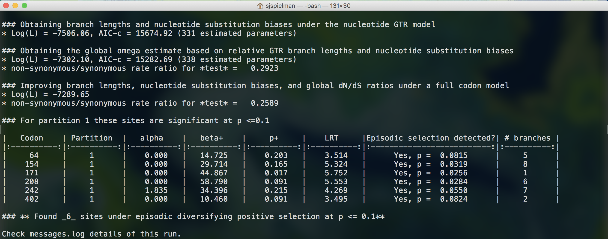
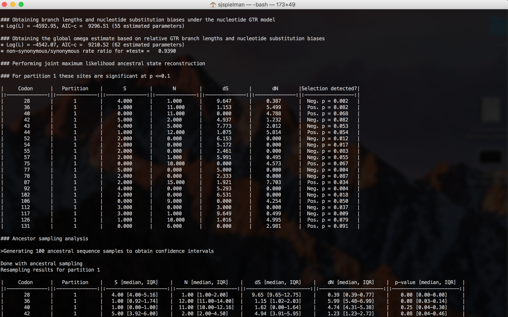
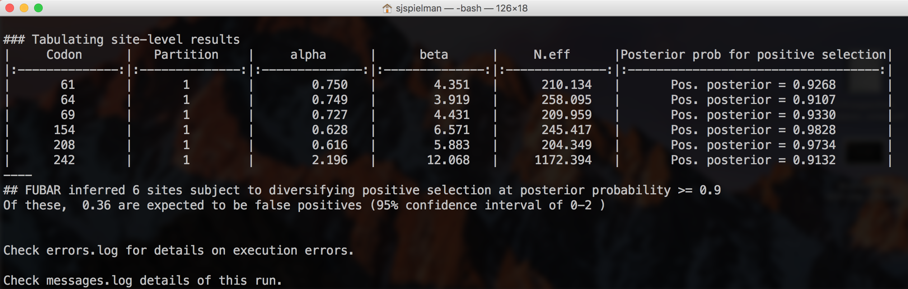
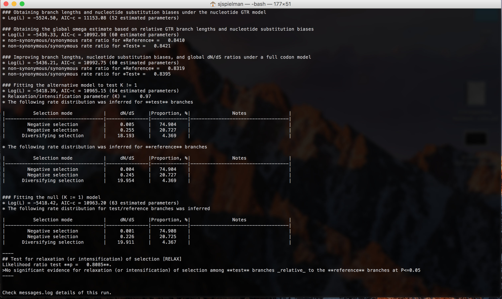
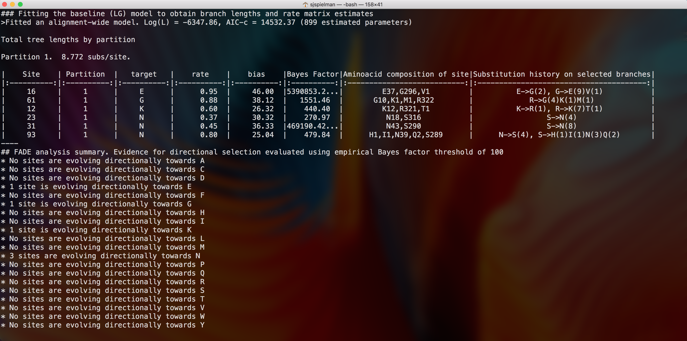

Using HyPhy interactive command line prompt to detect selection.
=================================

These tutorials outline how to prepare data and execute analyses in HyPhy's suite of methods for detecting natural selection in protein-coding alignments. 

All analyses described here produce a final output JSON-formatted file which can be uploaded to [HyPhy Vision](http://vision.hyphy.org) for exploration. You can obtain a description of JSON contents for all analyses [here](../resources/json-fields.pdf). In addition, each analyses will provide live [Markdown-formatted](https://en.wikipedia.org/wiki/Markdown) status indicators to the console while running. 

### Before you begin

1. Install the current release of HyPhy on your computer, as needed, using [these instructions](../installation.md).
2. This tutorial employs example datasets, available for download as a [zip file](https://github.com/veg/hyphy-site/blob/master/docs/tutorials/files/tutorial_data.zip?raw=true). Unpack this zip file on your machine for use and **remember the absolute path to this directory**. All datasets and output JSON files for this tutorial are in this zip file.
3. This tutorial assumes you are specifically using the HyPhy executable `hyphy`*. If you have installed a different executable (e.g. `HYPHYMPI`), you may need to alter some commands.  

_*Note: As of version 2.4.0, the old single-core executable, `hyphy`, has been removed; now the multi-core executable is refered to as `hyphy` (a `HYPHYMP` executable is still created for backwards compatability but it is just a sim-link to the `hyphy` executable). This was done for simplicity and because running hyphy with a single-core is rarely the desired choice_

### Preparing labeled phylogenies

Several analyses are accept labeled phylogenies to define branch sets for selection testing. Moreover, the method **RELAX** _requires_ a labeled phylogeny to compare selection pressures. To assist in tree labeling, we recommend using our [Phylotree Widget](http://phylotree.hyphy.org). Instructions for using this widget are available [here](../tutorials/phylotree.md).

### Preparing input data for HyPhy

All analyses require an alignment and corresponding phylogeny for analysis. There are options for preparing your data:

+ Prepare your data in two separate files with the alignment and phylogeny each. Most standard alignemnt formats are accepted (FASTA, phylip, etc.), and the phylogeny should be newick-formatted.
+ Prepare your data in a single file containing a FASTA-formatted alignment, beneath which should be a newick-formatted phylogeny.
+ Prepare your data as a NEXUS file with both a data matrix and tree block. Note that this file type will be necessary for performing a partitioned analysis, where different sites evolve according to different phylogenies (i.e. a recombination-corrected dataset from [**GARD**](../methods/selection-methods/#gard).

Each of these choices will trigger a slightly different data-input prompt, as described in the **General Information** section below.

### General Information

All available selection analyses in HyPhy can be accessed by launching HyPhy from the command line by typing `hyphy -i`* (or launching `HYPHYMPI -i` in an appropriate MPI environment) and entering **`1`** to reach the **`Selection Analyses`** menu: 

In this menu, launch your desired analyis by issuing its associated number (i.e. launch FEL by entering **`2`** upon reaching this menu).

Within each analysis, you will see a series of prompts for providing information. All analyses begin with the following prompts:

+ **`Choose Genetic Code`**. Generally, the universal genetic code (**`1`**) should be provided here, unless the dataset of interest uses a different NCBI-defined genetic code. For each option, the corresponding NCBI translation table is indicated.

+ **`Select a coding sequence alignment file`**. This option prompts for the dataset to analyze. Provide the **full path** to the dataset of interest. 
	+ If you provide a file containing only an alignment, HyPhy will issue a subsequent prompt: **`Please select a tree file for the data`**. Supply the full path to your newick-formatted phylogeny here.
	+ If you provide a file containing both an alignment and tree, HyPhy will prompt you to confirm that the tree provided should be used: **`A tree was found in the data file:...Would you like to use it (y/n)?`**. Enter **`y`** to use this tree, or enter **`n`** if a different tree is desired. HyPhy will then prompt for this path.
	+ If you provide a NEXUS file, Hyphy will accept the tree(s) as given and will not issue a subsequent prompt.
 

### Use BUSTED to test for alignment-wide episodic diversifying selection.
> See [here](../methods/selection-methods/#busted) for a description of the BUSTED method.

We will demonstate BUSTED use with an alignment of primate sequences for the KSR2 gene, a kinase suppressor of RAS-2, from [Enard et al, 2016](https://elifesciences.org/articles/12469). This dataset is in the file `ksr2.fna`.

Launch HyPhy from the command line by typing `hyphy -i`. Navigate through the prompt to reach the BUSTED analysis: Enter **1** for "Selection Analyses", and then **5** for "BUSTED". Respond to the following prompts:

+ **`Choose Genetic Code`**: Enter `1` to select the Universal genetic code.
+ **`Select a coding sequence alignment file`**: Enter the full path to the example dataset, `/path/to/tutorial_data/ksr2.fna`
+ **`A tree was found in the data file:...Would you like to use it (y/n)?`**: Enter `y` to use the provided tree.
+ **`Choose the set of branches to test for selection`**: To execute a BUSTED analysis that tests the entire tree for selection, enter option `1` for **All**. Alternatively, if you wish to test a subset of branches, enter a different option (2,3,4, or other). Note that any labels present in the provided phylogeny will be listed as options in this menu.
		
BUSTED will now run to completion and print markdown-formatted status indicators to screen, indicating the progression of model fits and concluding with the final BUSTED test results:

We therefore find that there is evidence for positive, diversifying selection in this dataset, at P=0.0015.
		
		

### Use aBSREL to find lineages which have experienced episodic diversifying selection.

> See [here](../methods/selection-methods/#absrel) for a description of the aBSREL method.

We will demonstate aBSREL use with an alignment of HIV-1 envelope protein-coding sequences collected from epidemiologically-linked donor-recipient transmission pairs, from [Frost et al, 2005](http://jvi.asm.org/content/79/10/6523). This dataset is in the file `hiv1_transmission.fna`.

Launch HyPhy from the command line by typing `hyphy -i`. Navigate through the prompt to reach the aBSREL analysis: Enter **1** for "Selection Analyses", and then **6** for "aBSREL". Respond to the following prompts:

+ **`Choose Genetic Code`**: Enter `1` to select the Universal genetic code.
+ **`Select a coding sequence alignment file`**: Enter the full path to the example dataset, `/path/to/tutorial_data/hiv1_transmission.fna`
+ **`A tree was found in the data file:...Would you like to use it (y/n)?`**: Enter `y` to use the provided tree.
+ **`Choose the set of branches to test for selection`**: To test for selection on each branch of your tree (an "exploratory" analysis that may suffer from low power), enter option `1` for **All**. Alternatively, if you wish to test for selection only on a subset of branches, enter a different option (2,3,4, or other). Note that any labels present in the provided phylogeny will be listed as options in this menu.
		
aBSREL will now run to completion and print markdown-formatted status indicators to screen, indicating the progression of model fits and concluding with the final aBSREL test results (abbreviated output shown here with final result only):

We therefore find that there is evidence for episodic diversifying selection in this dataset along three branches, after applying the Bonferroni-Holm procedure to control family-wise error rates. 		

### Use FEL to find sites which have experienced pervasive diversifying selection.

> See [here](../methods/selection-methods/#fel) for a description of the FEL method.

We will demonstate FEL use with an alignment of abalone sperm lysin sequences. This dataset is in the file `lysin.fna`.

Launch HyPhy from the command line by typing `hyphy -i`. Navigate through the prompt to reach the FEL analysis: Enter **1** for "Selection Analyses", and then **2** for "FEL". Respond to the following prompts:

+ **`Choose Genetic Code`**: Enter `1` to select the Universal genetic code.
+ **`Select a coding sequence alignment file`**: Enter the full path to the example dataset, `/path/to/tutorial_data/lysin.fna`
+ **`A tree was found in the data file:...Would you like to use it (y/n)?`**: Enter `y` to use the provided tree.
+ **`Choose the set of branches to test for selection`**: To perform tests for diversifying selection that consider all branches, enter option `1` for **All**. Alternatively, if you wish to test for site-level selection considering only a subset of branches, enter a different option (2,3,4, or other). Note that any labels present in the provided phylogeny will be listed as options in this menu.
+ **`Use synonymous rate variation? Strongly recommended YES for selection inference.`**: Enter `1` to employ synonymous rate variation. If you would like to constrain dS=1 at all sites, for example to calculate evolutionary rate point estimates, enter `2`. 
+ **`Select the p-value threshold to use when testing for selection`**: Provide the desired P-value threshold for calling sites as positively selected. We recommend `0.1` for FEL.

FEL will now run to completion and print markdown-formatted status indicators to screen, indicating the progression of model fits and concluding with the final FEL test results:

Note that FEL will formally test for both positive and negative selection at each site. This analysis found 22 sites under pervasive negative selection and 17 sites under pervasive positive selection at our specified threshold of P<0.1.

### Use MEME to find sites which have experienced pervasive diversifying selection.

> See [here](../methods/selection-methods/#meme) for a description of the MEME method.

We will demonstate MEME use with an alignment of abalone sperm lysin sequences. This dataset is in the file `lysin.fna`.

Launch HyPhy from the command line by typing `hyphy -i`. Navigate through the prompt to reach the MEME analysis: Enter **1** for "Selection Analyses", and then **1** for "MEME". Respond to the following prompts:

+ **`Choose Genetic Code`**: Enter `1` to select the Universal genetic code.
+ **`Select a coding sequence alignment file`**: Enter the full path to the example dataset, `/path/to/tutorial_data/h3_trunk.fna`
+ **`A tree was found in the data file:...Would you like to use it (y/n)?`**: Enter `y` to use the provided tree.
+ **`Choose the set of branches to test for selection`**: To perform tests for episodic selection that consider all branches, enter option `1` for **All**. Alternatively, if you wish to test for site-level selection considering only a subset of branches, enter a different option (2,3,4, or other). Note that any labels present in the provided phylogeny will be listed as options in this menu.
+ **`Select the p-value threshold to use when testing for selection`**: Provide the desired P-value threshold for calling sites as positively selected. We recommend `0.1` for MEME.

MEME will now run to completion and print markdown-formatted status indicators to screen, indicating the progression of model fits and concluding with the final MEME test results):

Note that MEME will formally test only for positive, but not negative, selection at each site. This analysis found 30 sites under episodic positive selection at our specified threshold of P<0.1.

### Use SLAC to find sites which have experienced pervasive diversifying selection.

> See [here](../methods/selection-methods/#slac) for a description of the SLAC method.

We will demonstate SLAC use with an alignment of abalone sperm lysin sequences. This dataset is in the file `lysin.fna`.

Launch HyPhy from the command line by typing `hyphy -i`. Navigate through the prompt to reach the SLAC analysis: Enter **1** for "Selection Analyses", and then **3** for "SLAC". Respond to the following prompts:

+ **`Choose Genetic Code`**: Enter `1` to select the Universal genetic code.
+ **`Select a coding sequence alignment file`**: Enter the full path to the example dataset, `/path/to/tutorial_data/h3_trunk.fna`
+ **`A tree was found in the data file:...Would you like to use it (y/n)?`**: Enter `y` to use the provided tree.
+ **`Choose the set of branches to test for selection`**: To perform tests for episodic selection that consider all branches, enter option `1` for **All**. Alternatively, if you wish to test for site-level selection considering only a subset of branches, enter a different option (2,3,4, or other). Note that any labels present in the provided phylogeny will be listed as options in this menu.
+ **`Select the number of samples used to assess ancestral reconstruction uncertainty`**: This prompt asks how many bootstrap samples to draw for generating confidence intervals. Provide the value `100`.
+ **`Select the p-value threshold to use when testing for selection`**: Provide the desired P-value threshold for calling sites as positively selected. We recommend `0.1` for MEME.

SLAC will now run to completion and print markdown-formatted status indicators to screen, indicating the progression of model fits and concluding with the final SLAC test results (abbreviated for visual purposes):

Note that SLAC will formally test for both positive and negative selection at each site. This analysis found 13 sites under pervasive negative selection and 8 sites under pervasive positive selection at our specified threshold of P<0.1.

### Use FUBAR to find sites which have experienced pervasive diversifying selection.

> See [here](../methods/selection-methods/#fubar) for a description of the FUBAR method.

We will demonstate FUBAR use with an alignment of influenza A H3N2 hemagglutinin sequences subsetted from [Meyer and Wilke 2015](http://journals.plos.org/plospathogens/article?id=10.1371/journal.ppat.1004940) to sample sequences only along the trunk. This dataset is in the file `h3_trunk.fna`.

+ **`Choose Genetic Code`**: Enter `1` to select the Universal genetic code.
+ **`Select a coding sequence alignment file`**: Enter the full path to the example dataset, `/path/to/tutorial_data/h3_trunk.fna`
+ **`A tree was found in the data file:...Would you like to use it (y/n)?`**: Enter `y` to use the provided tree.
+ **`Number of grid points per dimension`**: Press the `Enter` key to accept the default of 20.
+ **`Number of MCMC chains to run `**: Press the `Enter` key to accept the default of 5.
+ **`The length of each chain`**: Press the `Enter` key to accept the default of 2000000.
+ **`Use this many samples as burn-in`**:Press the `Enter` key to accept the default of 1000000.
+ **`How many samples should be drawn from each chain`**: Press the `Enter` key to accept the default of 100.
+ **`The concentration parameter of the Dirichlet prior `**: Press the `Enter` key to accept the default of 0.5.

FUBAR will now run to completion and print markdown-formatted status indicators to screen, indicating the progression of model fits and concluding with the final FUBAR test results (abbreviated output shown here with final result only):

Note that FUBAR will formally test for both positive and negative selection at each site, although it currently only reports positively selected sites to screen. This analysis found 6 sites under pervasive positive selection at a posterior probability >= 0.9

### Use RELAX to compare selective pressures on different parts of the tree

> See [here](../methods/selection-methods/#relax) for a description of the RELAX method.

We will demonstate RELAX use with an alignment of HIV-1 envelope protein-coding sequences collected from epidemiologically-linked donor-recipient transmission pairs, from [Frost et al, 2005](http://jvi.asm.org/content/79/10/6523). This dataset is in the file `hiv1_transmission_labeled.fna`.

Launch HyPhy from the command line by typing `hyphy -i`. Navigate through the prompt to reach the RELAX analysis: Enter **1** for "Selection Analyses", and then **7** for "RELAX". Respond to the following prompts:

+ **`Choose Genetic Code`**: Enter `1` to select the Universal genetic code.
+ **`Select a coding sequence alignment file`**: Enter the full path to the example dataset, `/path/to/tutorial_data/hiv1_transmission_labeled.fna`
+ **`A tree was found in the data file:...Would you like to use it (y/n)?`**: Enter `y` to use the provided tree.
+ **`Choose the set of branches to use as the _test_ set`**: Enter `2` to select all branches labeled "test" as the test set. Note that if your tree contains multiple labels, HyPhy will issue a subsequent prompt asking you to specify the reference set of lineages from these labels.
+ **`RELAX analysis type`**: Enter `1` to run only the RELAX test, and `2` to run the RELAX test as well as fit other descriptive models. Here, enter `2`.

RELAX will now run to completion and print markdown-formatted status indicators to screen, indicating the progression of model fits and concluding with the final RELAX test results (abbreviated output shown here with final result only):

This analysis did not detect any evidence of relaxed selection. However, if it had, a significant K>1 would indicate intensified selection on test lineages, and significant K<1 would indicate relaxed selection on test lineages.

### Use FADE to test for directional selection at individual sites in a *protein* alignment 

> See [here](../methods/selection-methods/#fade) for a description of the FADE method.

We will demonstate FADE use with an alignment of Influenza A (IAV) matrix protein 2 (MP2) amino-acid sequences analyzed by [Tamuri et al, 2009](https://doi.org/10.1371/journal.pcbi.1000564). This alignment contains sequences from both human and avian IAV strains and was originally used to test for shifts in selection pressures between hosts. Here, we will test for directional evolution in human host lineages (tested foreground) compared to avian host lineages (background). This dataset is in the file `MP2.fna`. Importantly, Fade **requires** a rooted phylogeny. As such, the phylogeny is this data file has been rooted and human host lineages have been labeled as `FG` using [Phylotree.js](http://phylotree.hyphy.org). 

Launch HyPhy from the command line by typing `hyphy -i`. Navigate through the prompt to reach the FADE analysis: Enter **1** for "Selection Analyses", and then **8** for "FADE". Respond to the following prompts:

+ **`Select a sequence alignment file`**: Enter the full path to the example dataset, `/path/to/tutorial_data/MP2.fna`
+ **`A tree was found in the data file:...Would you like to use it (y/n)?`**: Enter `y` to use the provided tree.
+ **`Choose the set of branches to use test for selection`**: Enter `5` to select all branches we have previously labeled as `FG`.
+ **`Number of grid points per dimension`**: Press the `Enter` key to accept the default of 20.
+ **`Baseline substitution model`**: Select a baseline protein model to use during directional selection inference. For this analysis, enter `1` for the LG model. 
+ **`Posterior estimation method`**: Enter `1` to select the *Variational Bayes* algorithm. Other algorithms are expected to give the same inferences of selection, and Variational Bayes will run the most quickly. If you opt for a slower algorithm, you will encounter some or all of these subsequent prompts:
	+ **`Number of MCMC chains to run `**: Press the `Enter` key to accept the default of 5.
	+ **`The length of each chain`**: Press the `Enter` key to accept the default of 2000000.
	+ **`Use this many samples as burn-in`**:Press the `Enter` key to accept the default of 1000000.
	+ **`How many samples should be drawn from each chain`**: Press the `Enter` key to accept the default of 100.
+ **`The concentration parameter of the Dirichlet prior `**: Press the `Enter` key to accept the default of 0.5.

FADE will now run to completion and print markdown-formatted status indicators to screen as it systematically tests each site for directional selection towards each amino acid, i.e `[fade] [A] Computing the phylogenetic likelihood function on the grid` for each amino acid through `Y`. The markdown output will conclude with the final FADE results for all sites with a Bayes Factor greater than 100. 

This analysis detected 6 sites directionally evolving, with one site evolving preferentially towards E, G, and K each, and three sites evolving preferentially towards N. Previous analysis of this gene, using a different method that detects shifts in selection pressure between two groups of lineages, identified sites 10 and 93 as evolving differently between host species ([Tamuri et al., 2009](https://doi.org/10.1371/journal.pcbi.1000564)). FADE similarly detected site 93, but not site 10, as well as 5 other sites with strong evidence for directional selection in human host lineages compared to avian host lineages.

Additional information reported to the console in markdown includes the site *composition* and *substitution history* along the foreground branches. Note that the composition includes inferred ancestral states at internal nodes. In other words, composition values will not directly correspond to the composition observed in the multiple sequence alignment. For example, the full composition site 16, reported as directionally evolving towards glutamate (E), contains 37 glutamates, 296 glycines, and one valine. The inferred substitution history at site 16 along foreground branches is that E has undergone two substitutions to G, and G has undergone 9 substitutions to E and one substitution to V. 