Using HyPhy-GUI to detect selection.
=================================

These tutorials outline how to use the HyPhy Graphical User Interface (GUI) desktop application [(HyPhy-GUI)](https://github.com/veg/hyphy-gui) to detect natural selection in protein-coding alignments. Information applicable to all analyses is provided in the General Information section followed by method specific tutorials for each of the available analyses:

### Before you begin

1. Install the beta version of the HyPhy-GUI using the download linked [here](https://github.com/veg/hyphy-gui).
2. Download the example datasets used in the tutorial [here](https://github.com/veg/hyphy-site/blob/master/docs/tutorials/files/tutorial_data.zip?raw=true). Unpack this zip file on your machine for use. All datasets and output JSON files for this tutorial are in this zip file.

### General Information

All available analyses can be accessed by the `Tools and Methods` drop down at the top right of the screen or, if you are unsure of which method to use, the recommended analysis for your specific question can be found using the "decision tree" on the home page of the application as shown below:

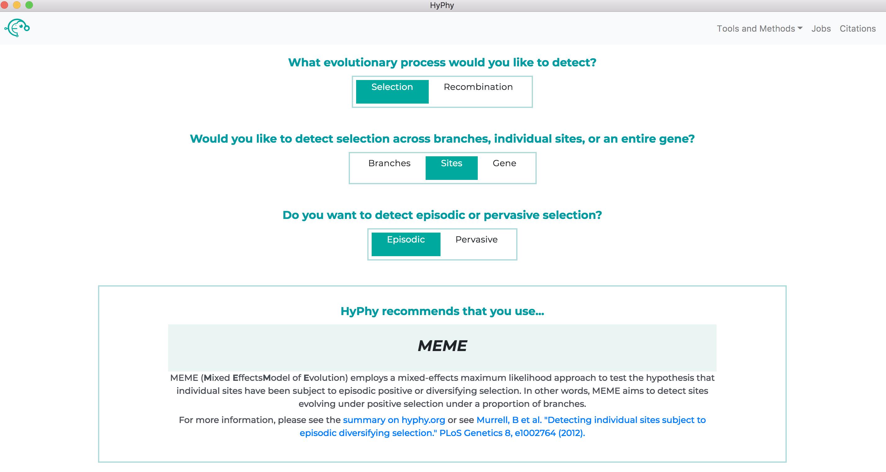

Within each analysis, you will see options for providing information. All analyses begin with the following prompts:

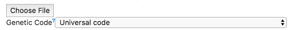

+ **`Choose File`**. This option prompts for the dataset to analyze.
	+ The HyPhy-GUI can currently accept files with or without trees in either fasta or nexus format.
	+ If you provide a file containing only an alignment, HyPhy will create a neighbor-joining tree from your data.
	+ If you provide a file containing both an alignment and tree, HyPhy will use the supplied tree by default but also create a neighbor-joining tree from your data and provide the option of using either tree during the branch selection phase (discussed later in this tutorial).
	
+ **`Genetic Code`**. The universal genetic code is selected by default and is generally the correct choice, unless the dataset of interest uses a different NCBI-defined genetic code.

The jobs page (accessed by clicking the `Jobs` button at the top right of the application) can be used to see the status of all jobs.

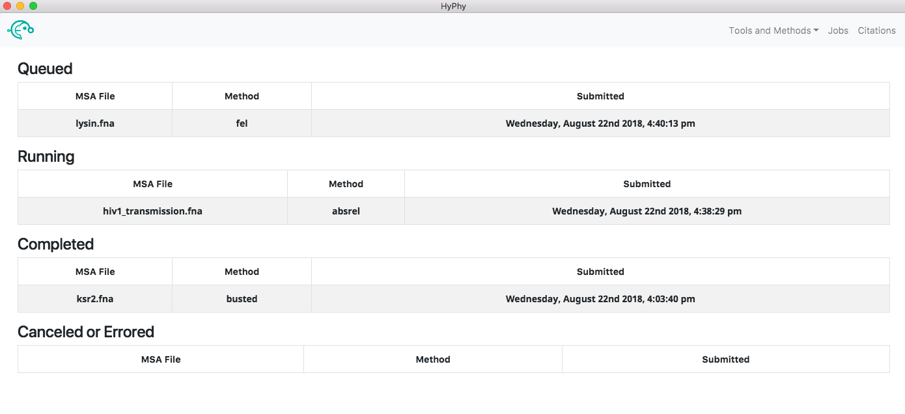

Clicking a running job will open the job progress page for that specific job, allowing you to see the output of the analysis in real time and, if you wish, cancel the job. Clicking a completed job will open the results page for that job, providing an interactive visualization of what the analysis found. Clicking a canceled or errored job will display the tail-end of the standard output of the analysis which may be helpful in understanding what caused the error.

The application automatically saves all the information associated with jobs including queued, running, completed and errored jobs. Upon exiting the application the state of all jobs will be saved. When the application is reopened the jobs page will look as it did prior to closing. The progress of a running job is not saved when exiting; therefore, if a job was running when the application was last closed, the "running job" will be restarted from the beginning when the application is reopened.

The sections below provide tutorials for each of the methods included with the HyPhy-GUI. The first method presented, BUSTED, includes additional information and screenshots to help walk you through using the applications interface for the first time. Enjoy! 

### Use BUSTED to test for alignment-wide episodic diversifying selection.
> See [here](../methods/selection-methods/#busted) for a description of the BUSTED method.

We will demonstrate BUSTED use with an alignment of primate sequences for the KSR2 gene, a kinase suppressor of RAS-2, from [Enard et al, 2016](https://elifesciences.org/articles/12469). This dataset is in the file `ksr2.fna`.

Open the HyPhy-GUI application and navigate to the Busted page. Select the `ksr2.fna` and click `Next`.

The branch selection options will then appear. To execute a BUSTED analysis that tests the entire tree for selection, use the selection drop-down to select all branches.

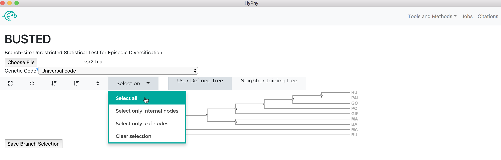

Alternatively, if you wish to test a subset of branches, you may select branches by selecting them, either by click on the branches directly or by using the drop-down menu available when a node is clicked.

Once the desired branches have been selected, click `Save Branch Selection` and then `Submit Analysis`. BUSTED will now run and print markdown-formatted status indicators to the screen, indicating the progression of model fits as shown below:

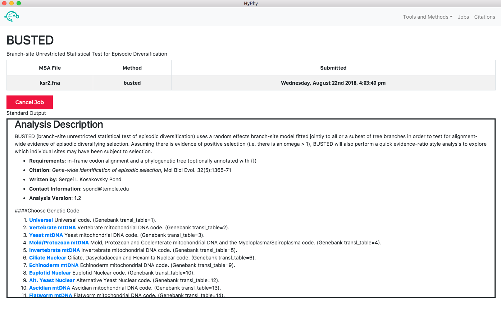

When the analysis is completed the results page will automatically open displaying the results of the analysis. As shown below, BUSTED found that there is evidence for positive, diversifying selection in this dataset, at P=0.001: 

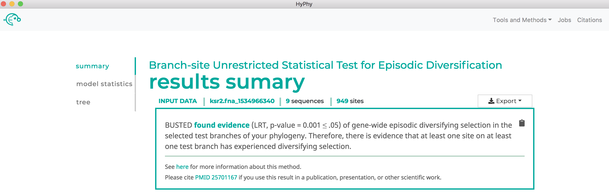

### Use aBSREL to find lineages which have experienced episodic diversifying selection.

> See [here](../methods/selection-methods/#absrel) for a description of the aBSREL method.

We will demonstrate aBSREL use with an alignment of HIV-1 envelope protein-coding sequences collected from epidemiologically-linked donor-recipient transmission pairs, from [Frost et al, 2005](http://jvi.asm.org/content/79/10/6523). This dataset is in the file `hiv1_transmission.fna`.

Navigate to the aBSREL page. Select the `hiv1_transmission.fna` file and click `Next`.

The branch selection options will then appear. To execute an aBSREL analysis that tests the entire tree for selection (an "exploratory" analysis that may suffer from low power), use the selection drop-down to select all branches. Alternatively, if you wish to test for selection only on a subset of branches, you may select branches by selecting them, either by click on the branches directly or by using the drop-down menu available when a node is clicked.

Once the desired branches have been selected, click `Save Branch Selection` and then `Submit Analysis`. aBSREL will now run and print markdown-formatted status indicators to the screen, indicating the progression of model fits:

When the analysis is completed the results page will automatically open displaying the results of the analysis. As shown below, aBSREL found that there is evidence for episodic diversifying selection in this dataset along three branches, after applying the Bonferroni-Holm procedure to control family-wise error rates:

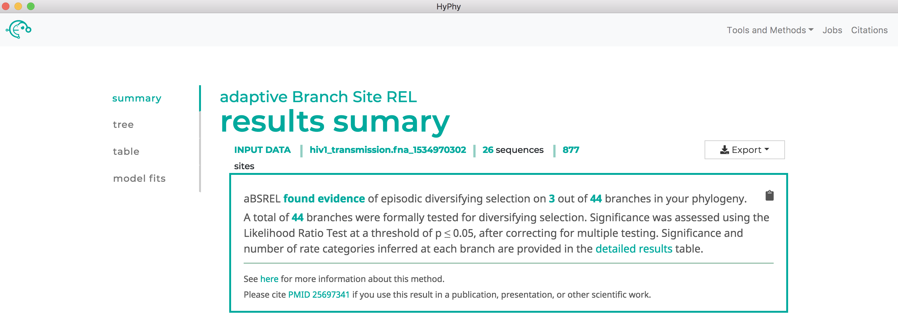

	

### Use FEL to find sites which have experienced pervasive diversifying selection.

> See [here](../methods/selection-methods/#fel) for a description of the FEL method.

We will demonstrate FEL use with an alignment of abalone sperm lysin sequences. This dataset is in the file `lysin.fna`.

Navigate to the FEL page. Select the `lysin.fna` file and click `Next` (We will use the recommended setting of including Synonymous rate variation).

The branch selection options will then appear. To perform tests for diversifying selection that consider all all branches, use the selection drop-down to select all branches. Alternatively, if you wish to test for selection only on a subset of branches, you may select branches by selecting them, either by click on the branches directly or by using the drop-down menu available when a node is clicked.

Once the desired branches have been selected, click `Save Branch Selection` and then `Submit Analysis`. FEL will now run and print markdown-formatted status indicators to the screen, indicating the progression of model fits. Note that FEL will formally test for both positive and negative selection at each site. As show below, this analysis found 22 sites under pervasive negative selection and 17 sites under pervasive positive selection at a threshold of P<0.1:

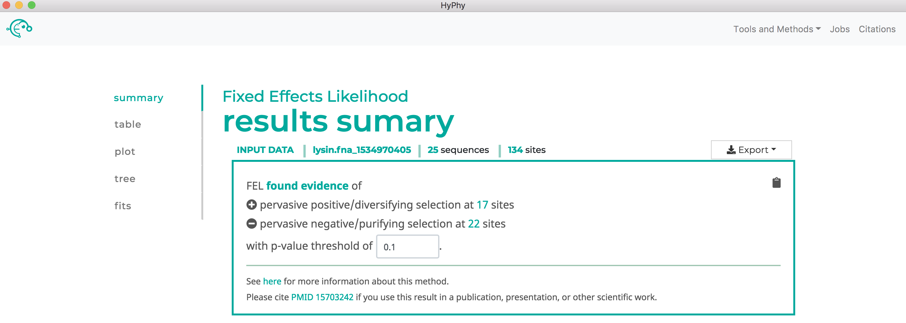

### Use MEME to find sites which have experienced pervasive diversifying selection.

> See [here](../methods/selection-methods/#meme) for a description of the MEME method.

We will demonstrate MEME use with an alignment of abalone sperm lysin sequences. This dataset is in the file `lysin.fna`.

Navigate to the MEME page. Select the `lysin.fna` file and click `Next`, then `Submit Analysis`. MEME will be run on all branches.

MEME will now run and print markdown-formatted status indicators to the screen, indicating the progression of model fits. __Note:__ The MEME analysis may take upwards of 30 minutes to complete depending on the speed of your computer.

MEME will formally test only for positive, but not negative, selection at each site. As show below, MEME found 30 sites under episodic positive selection at our specified threshold of P<0.1:

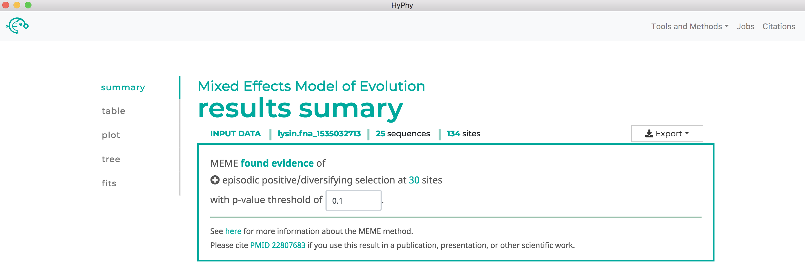

### Use SLAC to find sites which have experienced pervasive diversifying selection.

> See [here](../methods/selection-methods/#slac) for a description of the SLAC method.

We will demonstrate SLAC use with an alignment of abalone sperm lysin sequences. This dataset is in the file `lysin.fna`.

Navigate to the SLAC page. Select the `lysin.fna` file and click `Next`.

The branch selection options will then appear. To perform tests for diversifying selection that consider all all branches, use the selection drop-down to select all branches. Alternatively, if you wish to test for selection only on a subset of branches, you may select branches by selecting them, either by click on the branches directly or by using the drop-down menu available when a node is clicked.

Once the desired branches have been selected, click `Save Branch Selection` and then `Submit Analysis`. SLAC will now run and print markdown-formatted status indicators to the screen, indicating the progression of model fits. Note that SLAC will formally test for both positive and negative selection at each site. As shown below, SLAC found 13 sites under pervasive negative selection and 8 sites under pervasive positive selection at our specified threshold of P<0.1:

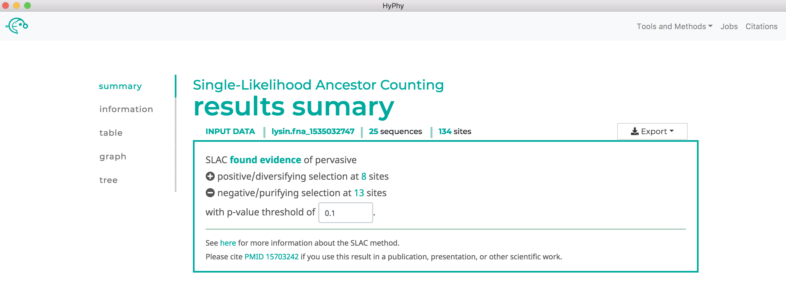

### Use FUBAR to find sites which have experienced pervasive diversifying selection.

> See [here](../methods/selection-methods/#fubar) for a description of the FUBAR method.

We will demonstrate FUBAR use with an alignment of influenza A H3N2 hemagglutinin sequences subsetted from [Meyer and Wilke 2015](http://journals.plos.org/plospathogens/article?id=10.1371/journal.ppat.1004940) to sample sequences only along the trunk. This dataset is in the file `h3_trunk.fna`.

Navigate to the FUBAR page and select the `h2_trunk.fna` file. Click the `Advanced options` button to display the additional options applicable to FUBAR analyses. As shown below, the default values for each of these options is already selected; these values can be adjusted but for this tutorial the default values are used. 

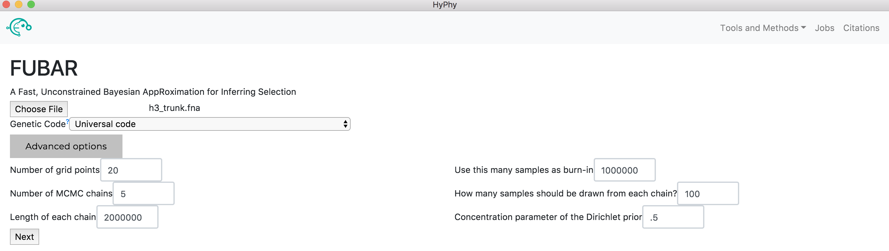

Click `Next`, then `Submit Analysis`. FUBAR will be run on all branches. FUBAR will now run and print markdown-formatted status indicators to the screen, indicating the progression of model fits.

Note that FUBAR will formally test for both positive and negative selection at each site, although it currently only reports positively selected sites to screen. As shown below, FUBAR found 6 sites under pervasive positive selection at a posterior probability >= 0.9:

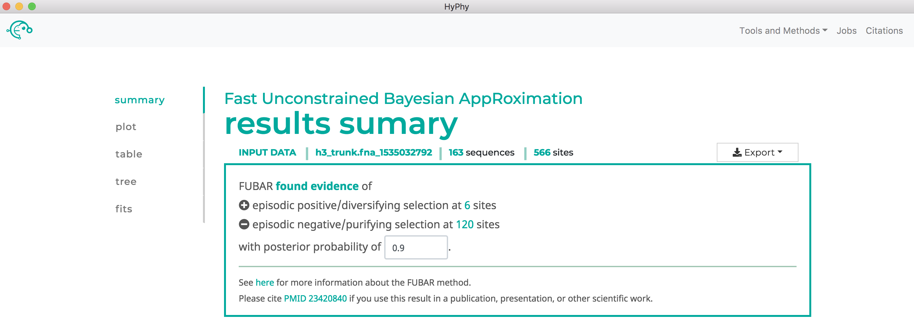

### Use RELAX to compare selective pressures on different parts of the tree

> See [here](../methods/selection-methods/#relax) for a description of the RELAX method.

We will demonstrate RELAX use with an alignment of HIV-1 envelope protein-coding sequences collected from epidemiologically-linked donor-recipient transmission pairs, from [Frost et al, 2005](http://jvi.asm.org/content/79/10/6523). This dataset is in the file `hiv1_transmission_labeled.fna`.

Navigate to the RELAX page, select the `hiv1_transmission_labeled.fna` file and click `Next`. 

The branch selection options will then appear. RELAX requires a subset of branches to be selected as `test` and a subset to be selected as `reference`. For this tutorial, all branches with the "{test}" label should be selected as `test` and all remaining branches should be selected as `reference` as shown below:

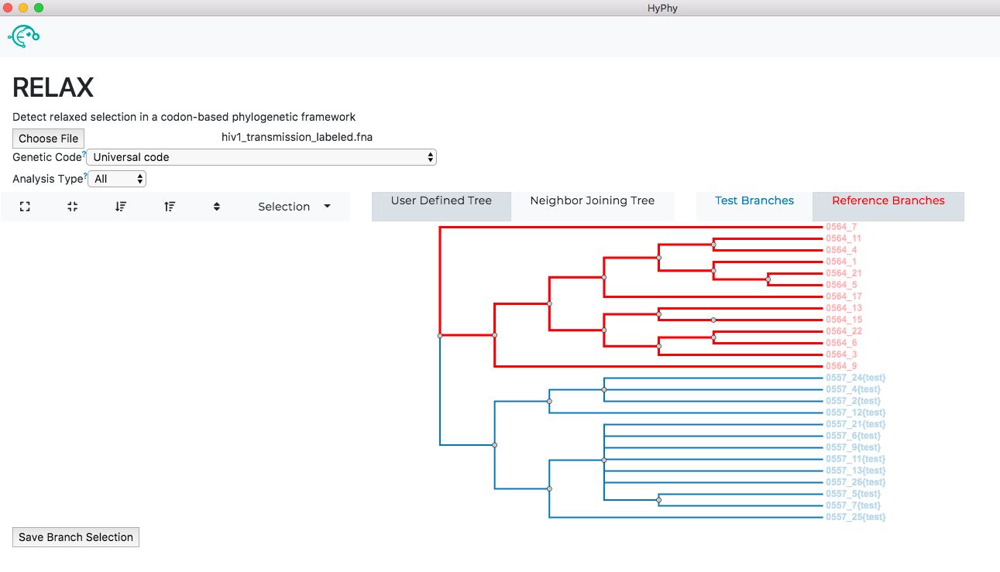

Once the desired branches have been selected, click `Save Branch Selection` and then `Submit Analysis`. RELAX will now run and print markdown-formatted status indicators to the screen, indicating the progression of model fits. __Note:__ The RELAX analysis may take upwards of 30 minutes to complete depending on the speed of your computer.

As shown below, RELAX did not detect any evidence of relaxed selection. However, if it had, a significant K>1 would indicate intensified selection on test lineages, and significant K<1 would indicate relaxed selection on test lineages:

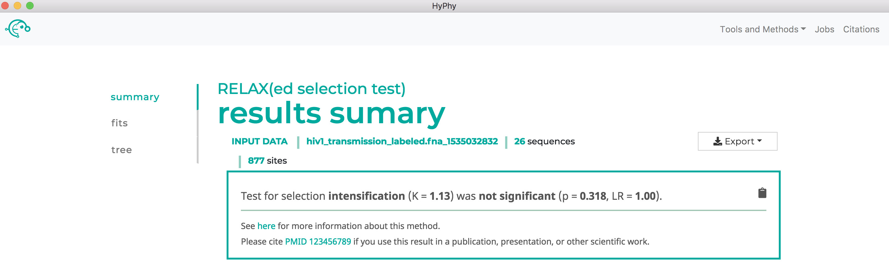
